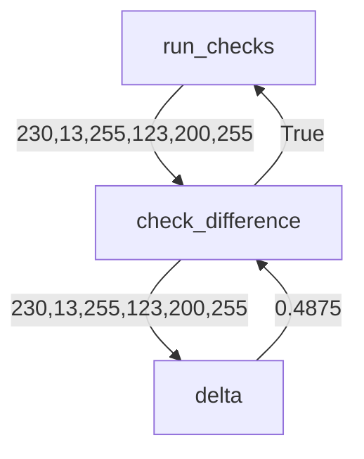
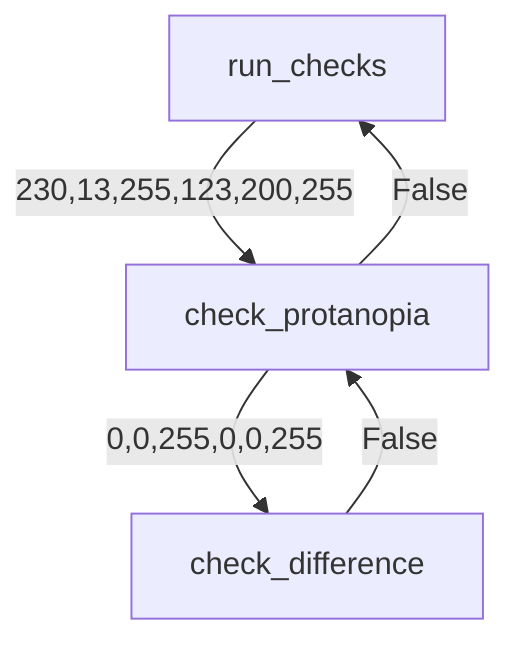
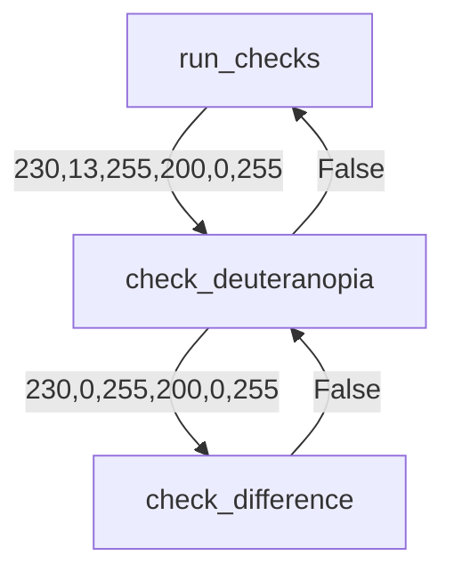
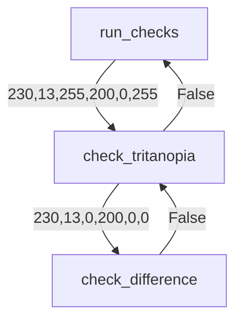

# Color Tester Design Document

The following document loosely presents a design for Color Tester.
Each function presented is required.

## Function Definitions

### check_difference

Compares two color RBG values to see how different they are.  Does
not convert, only compares.

#### Args:
* red_one (int): a color range between 0 and 255 representing the red for the first color
* green_one (int): a color range between 0 and 255 representing the green for the first color
* blue_one (int):a color range between 0 and 255 representing the blue for the first color
* red_two (int): a color range between 0 and 255 representing the red for the second color
* green_two (int): a color range between 0 and 255 representing the green for the second color
* blue_two (int): a color range between 0 and 255 representing the blue for the second color

#### Returns:
True if the difference defined by `delta` is greater than `MIN_DIFFERENCE`

#### Flow Diagram:
Assume the client entered the colors (230,13,255) and (123,200,255), eventually main will call run_checks, which will then call check_difference
with those values. To compare them without a color blindness filter. 

### check_protanopia
Compares two RBG values checking to see if when the colors are seen
by someone with protanopia, they are to similar. 

> Protanopia is when there is 0 red and greens and only blues, so
when comparing, all colors become their blue value only. 

#### Args
* red_one (int): a color range between 0 and 255 representing the red for the first color
* green_one (int): a color range between 0 and 255 representing the green for the first color
* blue_one (int):a color range between 0 and 255 representing the blue for the first color
* red_two (int): a color range between 0 and 255 representing the red for the second color
* green_two (int): a color range between 0 and 255 representing the green for the second color
* blue_two (int): a color range between 0 and 255 representing the blue for the second color

#### Returns
boolean: returns true if the colors are two similar when someone has protanopia

#### Flow Diagram
Assume the client entered the colors (230,13,255) and (123,200,255), eventually main will call run_checks, which will then call check_protanopia
with those values. 

### check_deuteranopia

Follows the same design as check_protanopia, but instead
of checking for protanopia checks colors with 
deuteranopia. 

#### Args
Same

#### Returns
boolean: returns true if the colors are two similar when someone has deuteranopia.

> Deuteranopia: Defined as when someone looses all greens in an RGB value scheme

#### Flow Diagram
Assume the client entered the colors (230,13,255) and (200,200,255), eventually main will call run_checks, which will then call check_deuteranopia with those values. 

### check_tritanopia
Follows the same design as check_protanopia, but instead
of checking for protanopia checks colors with 
tritanopia. 

> Tritanopia is when someone sees only red and green values of an RGB color scheme.

#### Args
Same

#### Returns
boolean: returns true if the colors are two similar when someone has tritanopia

#### Flow Diagram
Assume the client entered the colors (230,13,255) and (200,200,255), eventually main will call run_checks, which will then call check_deuteranopia with those values. 

### `main()`
