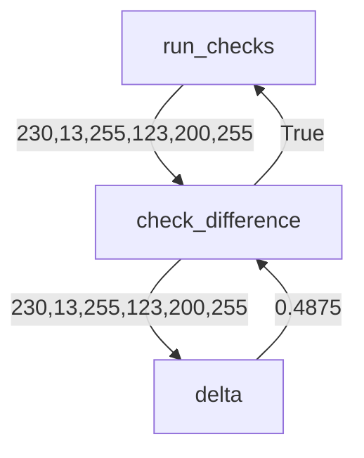
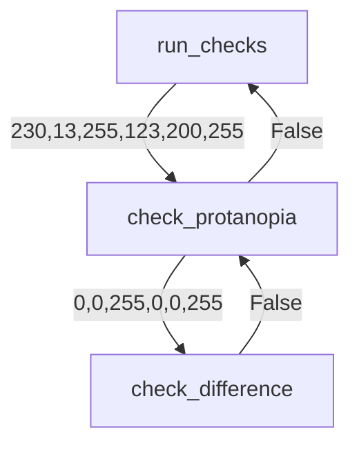
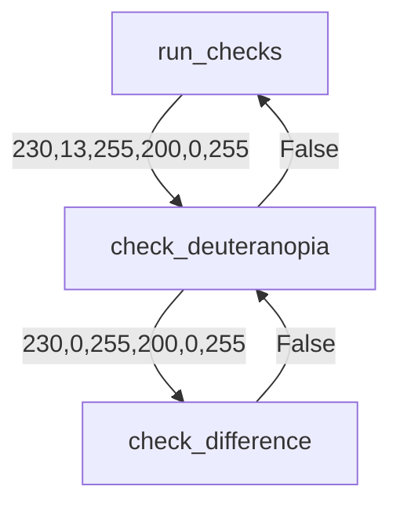
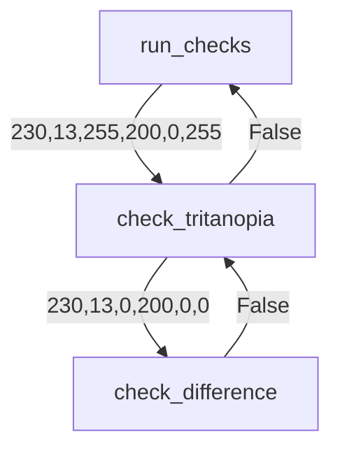
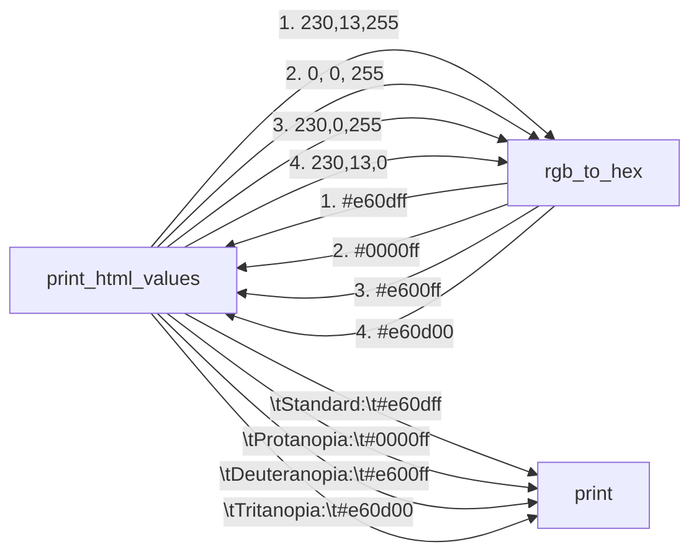
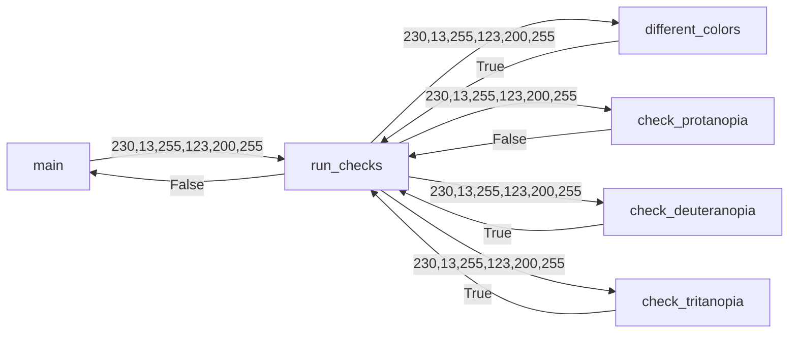

# Color Tester Design Document

The following document loosely presents a design for Color Tester.
Each function presented is required.


## Function Definitions

### check_difference

Compares two color RBG values to see how different they are.  Does
not convert, only compares.

#### Args:
* red_one (int): a color range between 0 and 255 representing the red for the first color
* green_one (int): a color range between 0 and 255 representing the green for the first color
* blue_one (int):a color range between 0 and 255 representing the blue for the first color
* red_two (int): a color range between 0 and 255 representing the red for the second color
* green_two (int): a color range between 0 and 255 representing the green for the second color
* blue_two (int): a color range between 0 and 255 representing the blue for the second color

#### Returns:
True if the difference defined by `delta` is greater than `MIN_DIFFERENCE`

#### Flow Diagram:
Assume the client entered the colors (230,13,255) and (123,200,255), eventually main will call run_checks, which will then call check_difference
with those values. To compare them without a color blindness filter. 




### check_protanopia
Compares two RBG values checking to see if when the colors are seen
by someone with protanopia, they are to similar. 

> Protanopia is when there is 0 red and greens and only blues, so
when comparing, all colors become their blue value only. 


#### Args
* red_one (int): a color range between 0 and 255 representing the red for the first color
* green_one (int): a color range between 0 and 255 representing the green for the first color
* blue_one (int):a color range between 0 and 255 representing the blue for the first color
* red_two (int): a color range between 0 and 255 representing the red for the second color
* green_two (int): a color range between 0 and 255 representing the green for the second color
* blue_two (int): a color range between 0 and 255 representing the blue for the second color

#### Returns
boolean: returns true if the colors are two similar when someone has protanopia

#### Flow Diagram
Assume the client entered the colors (230,13,255) and (123,200,255), eventually main will call run_checks, which will then call check_protanopia
with those values. 



### check_deuteranopia

Follows the same design as check_protanopia, but instead
of checking for protanopia checks colors with 
deuteranopia. 

#### Args
Same

#### Returns
boolean: returns true if the colors are two similar when someone has deuteranopia.

> Deuteranopia: Defined as when someone looses all greens in an RGB value scheme


#### Flow Diagram
Assume the client entered the colors (230,13,255) and (200,200,255), eventually main will call run_checks, which will then call check_deuteranopia with those values. 



### check_tritanopia
Follows the same design as check_protanopia, but instead
of checking for protanopia checks colors with 
tritanopia. 

> Tritanopia is when someone sees only red and green values of an RGB color scheme.

#### Args
Same

#### Returns
boolean: returns true if the colors are two similar when someone has tritanopia


#### Flow Diagram
Assume the client entered the colors (230,13,255) and (200,200,255), eventually main will call run_checks, which will then call check_deuteranopia with those values. 



### print_html_values
Prints out the html values of each color as the standard
color scheme, and the three color blind filters applied.

For example if `print_html_values(230,13,255)` is called,
will print out. 

```
	Standard:	    #e60dff
	Protanopia:	    #0000ff
	Deuteranopia:	#e600ff
	Tritanopia:	    #e60d00
```

The spacing before the word and after are `\t` characters, so your
spacing may vary. 

#### Args
* red (int): red color value
* green (int): green color value
* blue (int): blue color value

#### Flow Diagram
Using the example above with (230,13,255) the flow diagram could be.



1., 2., 3., 4. represent paired method calls and returns since rgb_to_hex is called four times at a minimum. The None return for `print` is not
shown for simplicity. 


### run_checks

Checks to see if there is a difference between two colors
for standard vision, Protanopia, Deuteranopia, Tritanopia. Will
print out if there is a difference or not before
returning the result. 

For example, if the following is called
```run_checks(230, 13,255, 123,200,255)``` run Checks will
print.

```
Normal vision:  Different
Protanopia:  Too similar
Deuteranopia:  Different
Tritanopia:  Different
```
and then return `False`. Only a single space is used between words, and no
indent. 

#### Args:
* red_one (int): a color range between 0 and 255 representing the red for the first color
* green_one (int): a color range between 0 and 255 representing the green for the first color
* blue_one (int):a color range between 0 and 255 representing the blue for the first color
* red_two (int): a color range between 0 and 255 representing the red for the second color
* green_two (int): a color range between 0 and 255 representing the green for the second color
* blue_two (int): a color range between 0 and 255 representing the blue for the second color


#### Returns:
bool: True if every color is different under all vision types, but False if only one vision type the colors are two similar.


#### Flow Diagram
Using the example above with (230, 13,255) as the first color and (123,200,255) as the second color the flow diagram could be.


 Important! Calls to print are left out for simplicity of the diagram! See
 example run to see how it will print. 


### `main()`
